# 🔐 Secure Transactions Mini-App

A production-ready TurboRepo monorepo implementing **envelope encryption** with AES-256-GCM. Built for the Mirfa Software Engineer Intern Challenge.

## Architecture

```mermaid
flowchart TD
    subgraph Browser["User (Browser)"]
        A["Enter JSON + partyId"] --> B["Encrypt & Store"]
        B --> C["View Encrypted Record"]
        C --> D["Decrypt"]
    end

    Browser -->|"HTTP (fetch)"| Frontend

    subgraph Frontend["Next.js Frontend — port 3000"]
        F["apps/web — App Router"]
    end

    Frontend -->|"HTTP (fetch)"| API

    subgraph API["Fastify API — port 3001"]
        direction LR
        G["POST /tx/encrypt"]
        H["GET /tx/:id"]
        I["POST /tx/:id/decrypt"]
        J["GET /health"]
    end

    API -->|"function call"| Crypto

    subgraph Crypto["@repo/crypto — packages/crypto"]
        direction TB
        K["1. Generate random DEK (32 bytes)"]
        K --> L["2. Encrypt payload with DEK (AES-256-GCM)"]
        L --> M["3. Wrap DEK with Master Key (AES-256-GCM)"]
        M --> N["4. Zero out DEK from memory"]
        N --> O["5. Return TxSecureRecord"]
    end

    API -->|"store / retrieve"| DB[("PostgreSQL — Supabase")]
```



## Security Design

### Why Envelope Encryption?

Instead of encrypting data directly with a master key, we use a **two-layer key hierarchy**:

| Layer | Key | Purpose |
|-------|-----|---------|
| 1 | Master Key (MK) | Wraps (encrypts) the DEK. Never touches plaintext data. |
| 2 | Data Encryption Key (DEK) | Encrypts the actual payload. Unique per transaction. |

**Benefits:**
- **Blast radius containment** — if a DEK is compromised, only one record is affected
- **Key rotation** — change the MK without re-encrypting all existing data
- **Separation of concerns** — mirrors how AWS KMS, Google Cloud KMS, and Azure Key Vault work

### Why AES-256-GCM?

AES-256-GCM is an **authenticated encryption** algorithm that provides:
- **Confidentiality** — data is encrypted with AES-256 in counter mode
- **Integrity** — a 16-byte authentication tag detects any tampering
- **No separate HMAC** — GCM combines encryption and authentication in one pass

### Why Random Nonces?

GCM requires a **unique nonce (IV)** for every encryption with the same key. Reusing a nonce with the same key completely breaks GCM security. We generate a fresh 12-byte random nonce for every operation.

### Why Constant-Time Comparison?

We use `crypto.timingSafeEqual()` for tag comparisons to prevent **timing side-channel attacks**. A regular `===` comparison leaks information about which byte position differs, allowing an attacker to forge a valid tag one byte at a time.

### Why Zero DEK After Use?

After encryption/decryption, we overwrite the DEK buffer with zeros (`buffer.fill(0)`). This is **defense in depth** against memory dump attacks. While not foolproof in a garbage-collected language, it raises the bar for attackers.

### Why Key Versioning?

The `mk_version` field records which master key version encrypted each record. This enables **zero-downtime key rotation**: deploy a new MK, encrypt new records with version N+1, and old records can still be decrypted with version N.

### What Would Be Different in Production?

| This Demo | Production |
|-----------|------------|
| MK in env variable | HSM or KMS (AWS KMS, Google Cloud KMS) |
| Single MK version | Automated key rotation with version tracking |
| Supabase PostgreSQL | Managed PostgreSQL with encryption at rest |
| No authentication | JWT/API keys with RBAC |
| No rate limiting | Rate limiting per API key |
| No audit logging | Full audit trail of all encrypt/decrypt operations |

## Quick Start

### Prerequisites

- **Node.js 20+**
- **pnpm** (`npm install -g pnpm`)

### Setup

```bash
# 1. Clone the repository
git clone <repo-url>
cd intern-challange

# 2. Install dependencies
pnpm install

# 3. Generate a master key
pnpm generate-master-key

# 4. Create .env file in the root
cp .env.example .env
# Paste the generated master key into .env

# 5. Start development servers
pnpm dev
```

This starts:
- **Next.js frontend** at `http://localhost:3000`
- **Fastify API** at `http://localhost:3001`

## API Documentation

### `GET /health`

Check server status.

```bash
curl http://localhost:3001/health
```

```json
{
  "status": "ok",
  "timestamp": "2025-01-15T10:30:00.000Z",
  "mk_loaded": true,
  "records": 0
}
```

### `POST /tx/encrypt`

Encrypt a payload and store the record.

```bash
curl -X POST http://localhost:3001/tx/encrypt \
  -H "Content-Type: application/json" \
  -d '{"partyId": "party_123", "payload": {"amount": 100, "currency": "AED"}}'
```

```json
{
  "success": true,
  "record": {
    "id": "550e8400-e29b-41d4-a716-446655440000",
    "partyId": "party_123",
    "createdAt": "2025-01-15T10:30:00.000Z",
    "payload_nonce": "a1b2c3d4e5f6a1b2c3d4e5f6",
    "payload_ct": "...",
    "payload_tag": "a1b2c3d4e5f6a1b2c3d4e5f6a1b2c3d4",
    "dek_wrap_nonce": "f6e5d4c3b2a1f6e5d4c3b2a1",
    "dek_wrapped": "...",
    "dek_wrap_tag": "f6e5d4c3b2a1f6e5d4c3b2a1f6e5d4c3",
    "alg": "AES-256-GCM",
    "mk_version": 1
  }
}
```

### `GET /tx/:id`

Retrieve an encrypted record (no decryption).

```bash
curl http://localhost:3001/tx/550e8400-e29b-41d4-a716-446655440000
```

### `POST /tx/:id/decrypt`

Decrypt a stored record.

```bash
curl -X POST http://localhost:3001/tx/550e8400-e29b-41d4-a716-446655440000/decrypt
```

```json
{
  "success": true,
  "partyId": "party_123",
  "payload": { "amount": 100, "currency": "AED" },
  "decryptedAt": "2025-01-15T10:31:00.000Z"
}
```

## Testing

```bash
# Run all tests (12 tests in the crypto package)
pnpm test
```

Tests cover:
1. Encrypt → decrypt roundtrip
2. Tampered ciphertext detection
3. Tampered payload tag detection
4. Tampered DEK wrap tag detection
5. Wrong nonce length validation
6. Wrong tag length validation
7. Invalid hex character validation
8. Wrong master key rejection
9. Independent party encryption
10. Nonce uniqueness verification
11. Empty ciphertext validation
12. Wrong algorithm validation

## Deployment to Vercel

### Deploy the API

```bash
cd apps/api
vercel

# Set environment variable in Vercel dashboard:
# MASTER_KEY = <your-64-char-hex-key>
```

### Deploy the Web App

```bash
cd apps/web
vercel

# Set environment variable in Vercel dashboard:
# NEXT_PUBLIC_API_URL = https://your-api.vercel.app
```

### Environment Variables

| Variable | Where | Description |
|----------|-------|-------------|
| `MASTER_KEY` | API | 64-char hex string (32 bytes) |
| `NEXT_PUBLIC_API_URL` | Web | URL of the deployed API |

## Project Structure

```
intern-challange/
├── apps/
│   ├── api/                  # Fastify backend
│   │   ├── src/
│   │   │   ├── index.ts      # Standalone server entry
│   │   │   ├── app.ts        # Fastify app builder
│   │   │   ├── store.ts      # In-memory record store
│   │   │   └── routes/
│   │   │       ├── tx.ts     # Transaction routes
│   │   │       └── health.ts # Health check
│   │   ├── api/
│   │   │   └── index.ts      # Vercel serverless entry
│   │   └── vercel.json
│   └── web/                  # Next.js frontend
│       └── app/
│           ├── layout.tsx
│           ├── page.tsx       # Single-page UI
│           └── globals.css
├── packages/
│   ├── crypto/               # Shared encryption library
│   │   ├── src/
│   │   │   ├── types.ts      # TxSecureRecord type
│   │   │   ├── errors.ts     # Custom error classes
│   │   │   ├── encrypt.ts    # Envelope encryption
│   │   │   ├── decrypt.ts    # Envelope decryption
│   │   │   ├── validate.ts   # Record validation
│   │   │   ├── keygen.ts     # Master key generator
│   │   │   └── index.ts      # Public exports
│   │   └── tests/
│   │       └── crypto.test.ts
│   └── tsconfig/             # Shared TypeScript configs
├── turbo.json
├── pnpm-workspace.yaml
└── package.json
```

## Trade-offs & Future Improvements

### Storage
- **Current:** Supabase PostgreSQL — persistent, hosted, works identically in dev and serverless
- **Future:** Managed PostgreSQL with encryption at rest, read replicas for scale

### Authentication
- **Current:** No auth — anyone can encrypt/decrypt
- **Future:** JWT tokens, API keys with scoped permissions, RBAC

### Key Management
- **Current:** Single master key in environment variable
- **Future:** AWS KMS / Google Cloud KMS with automatic rotation, key versioning

### Rate Limiting
- **Current:** None
- **Future:** Per-IP and per-API-key rate limiting to prevent abuse

### Audit Logging
- **Current:** Fastify request logging only
- **Future:** Structured audit log of all encrypt/decrypt operations with timestamps, party IDs, and IP addresses

### Monitoring
- **Current:** Health endpoint only
- **Future:** Prometheus metrics, alerting on decryption failures (potential attack indicator)

## Tech Stack

| Component | Technology |
|-----------|------------|
| Monorepo | TurboRepo + pnpm workspaces |
| Frontend | Next.js 14 (App Router) + Tailwind CSS |
| Backend | Fastify 5 |
| Storage | Supabase PostgreSQL |
| Encryption | Node.js native `crypto` (zero dependencies) |
| Testing | Vitest |
| Language | TypeScript (strict mode) |
| Deployment | Vercel |

---

Built with care for the Mirfa Software Engineer Intern Challenge.
